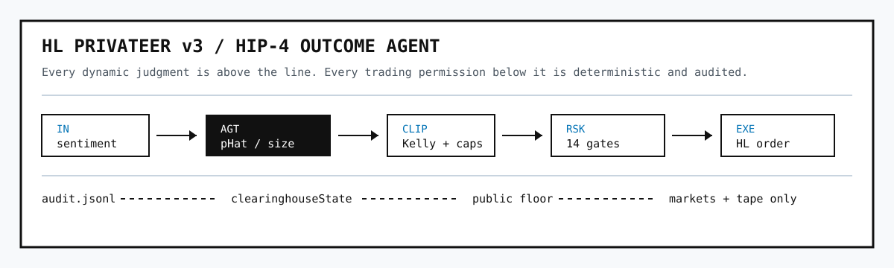

# HL Privateer

> A self-hosted trading agent for **Hyperliquid HIP-4 outcome contracts**,
> driven by sentiment.
>
> v1 was a different experiment — a 7-role LLM crew running discretionary
> long/short perpetual trades on Hyperliquid. It's concluded. The
> retrospective lives at [`/v1`](https://hlprivateer.xyz/v1) and
> [`legacy/README.md`](legacy/README.md), and the frozen v1 code is at
> [`/legacy`](legacy/). Read those if you want the story of what came
> before; the rest of this document is about v3.

```
+--------------------------------------------------------------------------------+
| HL PRIVATEER FLOOR // v3 // OUTCOME MARKETS                                    |
+--------------------------------------------------------------------------------+
| AGT [^]  "mkt-fed-pause: pHat=68% (mkt 62%) YES@0.620 $200 edge +6.0pp"        |
| RSK [!]  "ALLOW $200 YES@0.620"                                                |
| EXE [>]  "filled $200 @0.620 — 0 fees on open (HIP-4)"                         |
| OPS [#]  "agent online"                                                        |
+--------------------------------------------------------------------------------+
```

[hlprivateer.xyz](https://hlprivateer.xyz) ·
[github.com/ADWilkinson/hlprivateer.xyz](https://github.com/ADWilkinson/hlprivateer.xyz)

## The idea

Hyperliquid's [HIP-4 outcome
contracts](https://blog.quicknode.com/hip4-hyperliquid-outcome-contracts/)
are binary instruments: they settle to **0 or 1 in USDH** based on a
real-world event, and trade between the two on the same CLOB as spot and
perpetuals. The price at any moment is the market's implied probability
that the event will occur.

Sentiment — news flow, social posts, discussion on Farcaster, whatever
your feed — is also an estimate of that probability, just a fuzzier one.
The experiment is whether the gap between the sentiment-derived estimate
and the market price is tradeable, gated by a deterministic risk engine
strict enough to leave running.

## Architecture

One process. One agent. Deterministic plumbing around it.



```
sentiment sources ──► orchestrator ──► StrategyAgent (LLM)
                          │                  │
                          │           proposes side/size/limit/thesis
                          │                  │
                          ▼                  ▼
                    deterministic clip (Kelly + caps)
                          │
                          ▼
                    14 fail-closed risk gates
                          │
                          ▼ ALLOW
                    OrderRouter.place()  ──►  Hyperliquid HIP-4
                                                    │
                                                    ▼
                                           HyperliquidAccountant
                                           reads clearinghouseState
```

**`apps/agent`** is the only trading runtime. The orchestrator polls a set
of source adapters (RSS, X, Farcaster — whatever the operator wires in), buffers raw
sentiment items per market, and on each new item calls a single
`StrategyAgent.propose(ctx)` seam. The default agent shells out to an LLM
configured at the shell (`AGENT_LLM_COMMAND` — `claude -p`, `codex`, or
your own wrapper), feeds it the market + recent items + risk knobs +
exposure, and parses a JSON proposal back. The agent is the only dynamic
piece in the system. Everything around it is pure functions:

- **Size clip**: agent's suggested `sizeUsd` is capped by Kelly fraction
  (against the agent's own `pHat`), `maxStakePerMarket`, and remaining
  gross exposure. Pure math; no surprises.
- **Risk gates** (14, ordered cheapest-first, single-failure short-circuit):

  ```
  OPERATOR_HALT  →  INVALID_PROPOSAL  →  PROPOSAL_EXPIRED  →  STALE_SENTIMENT
                →  MARKET_NOT_TRADING  →  RESOLUTION_TOO_SOON
                →  RESOLUTION_TOO_FAR  →  CHALLENGE_WINDOW_OPEN
                →  EDGE_TOO_THIN       →  STAKE_PER_MARKET
                →  CONCURRENT_MARKETS  →  CORRELATED_EXPOSURE
                →  BANKROLL_DEPLETED   →  LOW_LIQUIDITY
  ```

  Each failure carries `{ code, reason, observed, threshold }`.

On ALLOW, the operator-supplied `OrderRouter` places the order on
Hyperliquid. The orchestrator appends proposals, risk decisions, fills,
agent failures, and order-placement failures to an append-only JSONL
audit at `data/audit.jsonl`.

A per-market mutex serialises evaluations: two near-simultaneous signals
for the same market can't both see pre-fill exposure and over-fill the
cap. The property-style invariant — total filled exposure ≤
`maxGrossExposureUsd` under any concurrency — is tested.

Positions, equity, and fills live on the exchange. The orchestrator does
not maintain a parallel ledger. `HyperliquidAccountant` reads
`clearinghouseState` (TTL-cached, default 4 s) and exposes the views the
risk gates need. Accountant HL errors propagate; there is no graceful
degradation. If order placement throws after an ALLOW, the system records
`order.failed`, writes the tape line, and does not pretend a fill exists.

The agent and order router both refuse to start if their dependencies
aren't wired. Production paths require real Hyperliquid access and a real
LLM completer. Tests inline their own fakes locally — the production code
paths don't ship any.

### What changed from v2

v2 was a two-process Redis-Streams system with a sentiment scorer
publishing `SentimentSignal` envelopes onto `hlpv2.sentiment` and an
oracle running three internal roles (SNT/EXE/RSK) that aggregated, blended
a Bayesian prior, computed Kelly, and proposed orders — all with
hard-coded math. The agent was a tiny scoring step at the input; the
strategy itself was static.

v3 collapses both processes into one app, drops the bus, drops the
six packages, and replaces the static `aggregate → blend → propose`
pipeline with a single `StrategyAgent` seam. The agent reads raw items
plus market + accountant state and proposes the trade directly. The
deterministic layer (Kelly clip, 14 gates) sits below it as a pure-function
safety net the agent can't bypass.

## Configuration

Two operator-owned, gitignored files drive everything; both have
committed templates that document the shape.

**`config/strategy.json`** holds the risk knobs, the LLM strategist
prompt, and an optional market-tag filter. Resolution order at startup,
first hit wins:

```
$STRATEGY_CONFIG_PATH  →  config/strategy.json  →  config/strategy.template.json  →  schema defaults
```

Every field is optional; missing keys fall back to Zod defaults baked
into `StrategyConfigSchema`:

```ts
{
  risk:         RiskConfig                          // bankroll, caps, edge thresholds, kelly
  prompts:      { strategist?: string }             // LLM system prompt
  marketFilter: { allowTags?: string[], blockTags?: string[] }
}
```

**`apps/agent/wiring.ts`** supplies the live `OutcomeMarketProvider` and
`OrderRouter`. `@nktkas/hyperliquid` doesn't yet expose HIP-4
outcome-market endpoints, so the operator implements both factories
against their HL access:

```bash
cp apps/agent/wiring.template.ts apps/agent/wiring.ts
```

The file exports `makeMarketProvider(hl)` and `makeOrderRouter(hl)`.
Agent main dynamic-imports it at startup; if it's missing or either
factory throws, the binary exits with a clear error.

## Running it

### Local demo floor

The fastest way to see the whole product loop is explicit demo mode. It
uses fixture HIP-4 markets, fixture sentiment, and in-memory fills so the
website can animate a real AGT → RSK → EXE → OPS tape without touching
Hyperliquid or requiring an LLM command. It is not a production fallback.

```bash
bun install

(cd apps/agent && \
  AGENT_DEMO=1 \
  AGENT_HTTP_PORT=4100 \
  AGENT_INTERVAL_MS=5000 \
  bun run dev)

(cd apps/web && \
  NEXT_PUBLIC_API_BASE_URL=http://127.0.0.1:4100 \
  bun run dev)

open http://127.0.0.1:3000/floor
```

### Production runtime

```bash
bun install
bun run typecheck     # both workspaces
bun run test          # agent tests + web smoke tests
bun run build         # production build

export AGENT_HL_USER=0xYourWalletAddress
export AGENT_OPERATOR_TOKEN=...                # for /v1/operator/halt|resume
export AGENT_LLM_COMMAND="claude -p"           # or codex, or your wrapper

# Optional knobs:
#   AGENT_HL_TESTNET=1            point at testnet
#   AGENT_HL_INFO_URL=...         override /info URL
#   AGENT_HL_TTL_MS=4000          accountant cache TTL
#   AGENT_HTTP_PORT=4100          HTTP port (default 4100)
#   AGENT_INTERVAL_MS=30000       source poll interval
#   AGENT_AUDIT_PATH=data/audit.jsonl
#   AGENT_PNL_BASELINE_USD=...    baseline for /v1/public/floor pnlPct
#   AGENT_FIXTURE=path/to.json    optional fixture source
#   AGENT_DEMO=1                  explicit local demo only; no HL/LLM required

cp apps/agent/wiring.template.ts apps/agent/wiring.ts && $EDITOR $_
cp config/strategy.template.json   config/strategy.json   && $EDITOR $_

(cd apps/agent && bun run dev) &

curl http://127.0.0.1:4100/healthz
curl http://127.0.0.1:4100/v1/public/floor
```

`apps/web` prepares the standalone server after each production build by
copying `public/` and `.next/static/` into `.next/standalone/apps/web/`.
Without that step, the server returns HTML but browsers cannot load CSS or
client chunks.

## HTTP surface

| Method | Path                      | Auth   | Returns                                       |
|--------|---------------------------|--------|-----------------------------------------------|
| GET    | `/healthz`                | —      | mode, metrics, equityUsd, openMarkets         |
| GET    | `/metrics`                | —      | Prometheus 0.0.4 — mode + equity + counters   |
| GET    | `/v1/public/markets`      | —      | Markets with `pHat` + `edge` (no sizes)       |
| GET    | `/v1/public/floor`        | —      | Mode + markets + role tape + `pnlPct`         |
| GET    | `/v1/public/floor-tape`   | —      | Last ~50 role-tape lines                      |
| POST   | `/v1/operator/halt`       | Bearer | Halts the agent                               |
| POST   | `/v1/operator/resume`     | Bearer | Resumes it                                    |

Operator routes return 401 when `AGENT_OPERATOR_TOKEN` is unset. The
public surface deliberately omits positions, notional, bankroll,
sentiment payloads, and the agent's thesis — pHat and edge are enough for
someone to cross-reference their own model.

## Repo

```
apps/
  agent/              single-process agent: orchestrator, risk, math,
                      accountant, hl client, strategy seam, HTTP, audit
  web/                Next.js: product site, /floor, /v1 retrospective
config/
  strategy.template.json    Public defaults (committed)
  strategy.json             Operator's real strategy (gitignored)
legacy/               Frozen v1 code, docs, and infra. See legacy/README.md.
docs/SPEC.md          Full v3 architecture + invariants
```

Bun + TypeScript 5.7, Zod schemas for contracts. Hyperliquid via plain
`fetch` against the `/info` endpoint. Next.js 15 + Tailwind for the
public site. No Redis. No turbo. No active internal packages.

## More

- [`docs/SPEC.md`](docs/SPEC.md) — full v3 spec
- [`apps/agent/`](apps/agent/) — the agent app
- [`legacy/README.md`](legacy/README.md) and [`/v1`](https://hlprivateer.xyz/v1) — v1 retrospective
- [`llms.txt`](llms.txt), [`skills.md`](skills.md) — machine-readable summaries

## Disclaimer

Experimental software for research and operational automation. Not
financial advice. All trading decisions and losses are the operator's
responsibility. Use at your own risk.

## License

MIT
